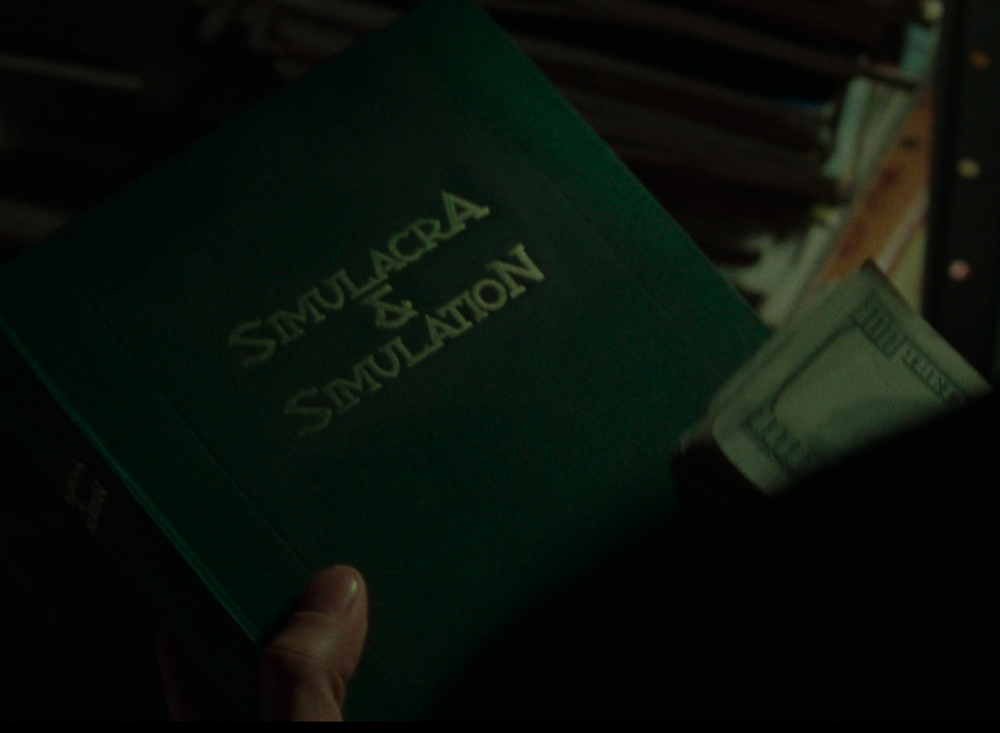
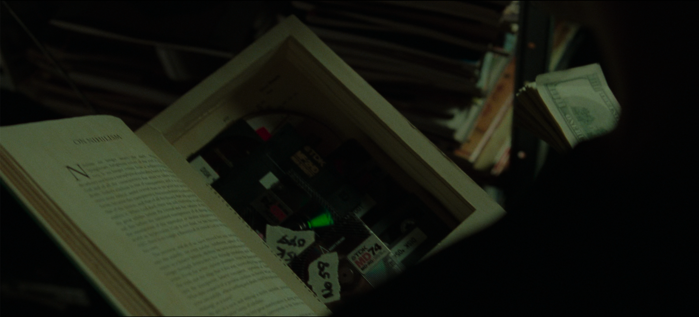

+++
date = '2025-06-24T21:32:53+01:00'
draft = false
title = 'Simulacra & Simulation'
description = 'Copying the fake imposture.'
tags = ['lamp', 'LED', 'Matrix', 'book', 'diy']
featured_image = 'pics/beauty1.jpg'
featured_image_class = 'cover bg-center'
+++

2 years ago, I found this [Instructables](https://www.instructables.com/Book-Light-Inside-a-Book/) by *lonesoulsurfer*. The idea is great, the build felt quite easy so I bookmarked it, and started wondering which book I wanted to torture to do this build. Thinking about it, I realized that I would be using an old book without any value, to destroy it. I was not going to destroy a book I liked. So the idea of making my own cover started and with that the possibility of using a book that doesn't really exist.
I always wanted to reproduce the hollow book seen in The Matrix. I thought putting light inside this book was not really out of place, and after all, if I make one book cover, I guess I could make two!

This build was the first use of my 3D printer as I wanted to emboss the title of the book. I started doing some embossing tests, then with the fabric I had bought. I then made some tests to find the best solution for the golden letters. As expected, a scriber was giving the best results.

 

 The rest of the build is perfectly described inside the [Instructables](https://www.instructables.com/Book-Light-Inside-a-Book/) build.

































